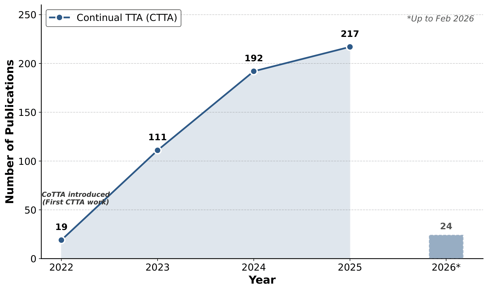

<h1 align="center">Continual Test-Time Adaptation: A Comprehensive Survey</h1>

*A curated list of papers, resources and future directions on **Continual Test-Time Adaptation (CTTA)** (as of Feb 2026).*

> [!NOTE]
> 🚧 **This repository is currently a Work in Progress.** 🚧
>
> We are actively updating the survey and taxonomy. Contributions and suggestions are welcome!

---

## Table of Contents

- [Problem and Motivation](#problem-and-motivation)
- [Need for Online Continual Adaptation](#need-for-online-continual-adaptation)
- [Unified Taxonomy](#unified-taxonomy)
- [Optimization-based Approaches](#optimization-based-approaches)
  - [Entropy Minimization](#entropy-minimization)
  - [Pseudo-Labeling](#pseudo-labeling)
  - [Parameter Restoration](#parameter-restoration)
  - [Topology Preservation](#topology-preservation)
- [Parameter-Efficient Methods](#parameter-efficient-methods)
  - [Normalization Layer Statistics](#normalization-layer-statistics)
  - [Adaptive Updates](#adaptive-updates)
- [Architecture-based](#architecture-based)
  - [Teacher-Student frameworks](#teacher-student-frameworks)
  - [Adapters](#adapters)
  - [Visual Prompting](#visual-prompting)
  - [Masked Modeling](#masked-modeling)
- [🔄 Continual Domain Shift Patterns](#-continual-domain-shift-patterns)
- [📊 Benchmarks](#-benchmarks)
- [🚀 Emerging Trends and Future Directions](#-emerging-trends-and-future-directions)
- [🤝 Contributing](#-contributing)
---

## Problem and Motivation

  

Deep neural nets achieve remarkable performance when training and test data share the same distribution, but this assumption frequently breaks in real-world deployment, where data undergoes continual distributional shifts. Continual Test-Time Adaptation (CTTA) addresses this challenge by adapting pretrained models to non-stationary target distributions on-the-fly, without access to source data or labeled targets, while mitigating two critical failure modes: catastrophic forgetting of source knowledge and error accumulation from noisy pseudo-labels over extended time horizons. 

---

##  Need for Online Continual Adaptation

1. **Data Privacy** - Test samples should be processed in an online fashion without storage or reuse, especially in privacy-sensitive settings (e.g., medical or personal devices).
2. **Real-Time Responsiveness** - Adaptation must incur minimal latency. In safety-critical applications such as autonomous driving, even small delays can have significant physical consequences.
3. **Non-Stationary Environments** - Data distributions evolve continuously (e.g., lighting, weather, sensor drift). Repeated passes over outdated data may degrade performance.
4. **Resource Constraints** - Edge and embedded devices have limited memory and compute budgets. Adaptation strategies should avoid heavy iterative optimization or large memory overhead.

### Emerging Directions
1. **On-Demand Adaptation** - Instead of updating the model continuously, adaptation can be triggered only when a significant domain shift is detected. This reduces unnecessary computation while preserving robustness.
2. **Forward-only Adaptation** - There is a need to remove backpropagation entirely, enabling lightweight adaptation suitable for resource-constrained or real-time deployment. FOA gives a new direction to the field of CTTA.
3. **Adaptation of Foundation Models** 
    
---

## Unified Taxonomy

The figure below illustrates the growth of CTTA research over the years.

  

We organize methods into three main families, based on what they adapt and their adaptation strategies. Based on a paper's core contribution, these are: 

1. **Optimization-based** 

2. **Parameter-Efficient**

3. **Architecture-based**

<i>We mention the representative papers for each category.</i> 

### Optimization-based Approaches
We list papers that discuss key paradigms: 1) entropy minimization, which encourages confident predictions, 2) pseudo-labeling, which leverages, and 3) parameter restoration, which helps in mitigating forgetting by recovering source knowledge, 4) preservation of class topologies.

#### Entropy Minimization
1. [Tent: Fully Test-Time Adaptation by Entropy Minimization, ICLR 2021](https://openreview.net/pdf?id=uXl3bZLkr3c)
2. [Efficient Test-Time Model Adaptation without Forgetting, ICML 2022](https://proceedings.mlr.press/v162/niu22a.html)
3. [Towards Stable Test-Time Adaptation in Dynamic Wild World, ICLR 2023](https://openreview.net/pdf?id=g2YraF75Tj)
4. [Robust mean teacher for continual and gradual test-time adaptation, CVPR 2023](https://openaccess.thecvf.com/content/CVPR2023/papers/Dobler_Robust_Mean_Teacher_for_Continual_and_Gradual_Test-Time_Adaptation_CVPR_2023_paper.pdf)
5. [SANTA: Source Anchoring Network and Target Alignment for Continual Test Time Adaptation, TMLR 2023](https://openreview.net/pdf?id=V7guVYzvE4)
6. [Sotta: Robust test-time adaptation on noisy data streams, NeurIPS 2023](https://arxiv.org/abs/2310.10074)
7. [Entropy is not Enough for Test-Time Adaptation: From the Perspective of Disentangled Factors, ICLR 2024](https://arxiv.org/abs/2403.07366)
8. [TEA: Test-time Energy Adaptation, CVPR 2024](https://arxiv.org/abs/2311.14402)
9. [Ranked Entropy Minimization for Continual Test-Time Adaptation, ICML 2025](https://arxiv.org/abs/2505.16441)
10. [Lifelong Test-Time Adaptation via Online Learning in Tracked Low-Dimensional Subspace, NeurIPS 2025](https://openreview.net/pdf?id=NFvAa2hNzH)

#### Pseudo-Labeling
1. [If your data distribution shifts, use self-learning, arXiv 2021](https://arxiv.org/abs/2104.12928)
2. [Continual Test-time Domain Adaptation via Dynamic Sample Selection, CVPR 2024](https://arxiv.org/abs/2310.03335)
3. [Contrastive Test-Time Adaptation, CVPR 2022](https://arxiv.org/abs/2204.10377)
4. [Less is More: Pseudo-Label Filtering for Continual Test-Time Adaptation, arXiv 2024](https://arxiv.org/abs/2406.02609)

#### Parameter Restoration
1. [Continual Test-Time Domain Adaptation, CVPR 2022](https://arxiv.org/abs/2203.13591)
2. [A Probabilistic Framework for Lifelong Test-Time Adaptation, CVPR 2023](https://arxiv.org/abs/2212.09713)
3. [Robust Test-Time Adaptation in Dynamic Scenarios, CVPR 2023](https://arxiv.org/abs/2303.13899)

#### Topology Preservation
1. [Maintaining Consistent Inter-Class Topology in Continual Test-Time Adaptation, CVPR 2025](https://openaccess.thecvf.com/content/CVPR2025/papers/Ni_Maintaining_Consistent_Inter-Class_Topology_in_Continual_Test-Time_Adaptation_CVPR_2025_paper.pdf)

### Parameter-Efficient Methods

Here, we list works that focus on estimating normalization layer statistics and adaptively selecting parameters to update.

#### Normalization Layer Statistics
1. [Improving robustness against common corruptions by covariate shift adaptation, NeurIPS 2020](https://arxiv.org/abs/2006.16971)
2. [MixNorm: Test-Time Adaptation Through Online Normalization Estimation, arXiv 2021](https://arxiv.org/abs/2110.11478)
3. [NOTE: Robust Continual Test-time Adaptation Against Temporal Correlation, NeurIPS 2022](https://arxiv.org/abs/2208.05117)
4. [MECTA: Memory-Economic Continual Test-time Adaptation, ICLR 2023](https://openreview.net/forum?id=N92hjSf5NNh)
5. [Ttn: A domain-shift aware batch normalization in test-time adaptation, ICCV 2023](https://arxiv.org/abs/2302.05155)

#### Adaptive Updates
1. [Layer-wise Auto-Weighting for Non-Stationary Test-Time Adaptation, WACV 2024](https://arxiv.org/abs/2311.05858)
2. [PALM: Pushing Adaptive Learning Rate Mechanisms for Continual Test-Time Adaptation, AAAI 2025](https://arxiv.org/abs/2403.10650)
3. [Parameter-Selective Continual Test-Time Adaptation, ACCV 2024](https://openaccess.thecvf.com/content/ACCV2024/papers/Tian_Parameter-Selective_Continual_Test-Time_Adaptation_ACCV_2024_paper.pdf)
4. [Test-Time Model Adaptation with Only Forward Passes, ICML 2024](https://arxiv.org/pdf/2404.01650)

### Architecture-based
We include papers that modify the model architecture. This includes teacher-student frameworks, adapters, visual prompting, and masked modeling.

#### Teacher-Student frameworks
1. [Continual Test-Time Domain Adaptation, CVPR 2022](https://arxiv.org/abs/2203.13591)
2. [Robust mean teacher for continual and gradual test-time adaptation, CVPR 2023](https://openaccess.thecvf.com/content/CVPR2023/papers/Dobler_Robust_Mean_Teacher_for_Continual_and_Gradual_Test-Time_Adaptation_CVPR_2023_paper.pdf)
3. [C-CoTTA: Controllable Continual Test-Time Adaptation, arXiv 2024](https://arxiv.org/abs/2405.14602)

#### Adapters
1. [EcoTTA: Memory-Efficient Continual Test-time Adaptation via Self-distilled Regularization, CVPR 2023](https://arxiv.org/abs/2303.01904)
2. [ViDA: Homeostatic Visual Domain Adapter for Continual Test Time Adaptation, ICLR 2024](https://arxiv.org/abs/2306.04344)
3. [Efficient Test-Time Adaptation of Vision-Language Models, CVPR 2024](https://arxiv.org/abs/2403.18293)
4. [Buffer layers for Test-Time Adaptation, NeurIPS 2025](https://openreview.net/pdf?id=sSZ9OM08KT)

#### Visual Prompting
1. [Visual Domain Prompt for Continual Test Time Adaptation, AAAI 2023](https://arxiv.org/abs/2212.04145)
2. [OT-VP: Optimal Transport-guided Visual Prompting for Test-Time Adaptation, WACV 2024](https://arxiv.org/abs/2407.09498)
3. [DPCore: Dynamic Prompt Coreset for Continual Test-Time Adaptation, ICML 2025](https://arxiv.org/abs/2406.10737)
4. [Class-aware Domain Knowledge Fusion and Fission for Continual Test-Time Adaptation, NeurIPS 2025](https://openreview.net/pdf?id=F74FXkicGK)

#### Masked Modeling
1. [Continual-MAE: Adaptive Distribution Masked Autoencoders for Continual Test-Time Adaptation, CVPR 2024](https://arxiv.org/abs/2312.12480)

---

## 🔄 Continual Domain Shift Patterns

1. **Continual Structured Change** - Target domains arrive in a fixed sequential order.
2. **Gradual Domain Transitions** - Relax the assumption of abrupt, instantaneous boundaries between consecutive domains (as in RDumb, BECoTTA).
3. **Sample-Level Shifts** - Mixed shifts, small batch sizes, and online imbalanced label distribution shift (as in SAR).
4. **Continually Changing Domains** - Temporally correlated sampling (as in RoTTA).
5. **Continual Dynamic Changes** - Abrupt changes in domains with recurrence (as in DPCore).
6. **Long-Term Non-Stationary Shifts** - (as in ReservoirTTA).

---

## 📊 Benchmarks

### Image Classification

| Dataset | Source Domains | Target Domains | Shift Types |
|:---|:---|:---|:---|
| [CIFAR-10C](https://zenodo.org/record/2535967#.ZBiI7NDMKUk) | CIFAR-10 | CIFAR-10C | 15 visual corruptions |
| [CIFAR-100C](https://zenodo.org/record/3555552#.ZBiJA9DMKUk) | CIFAR-100 | CIFAR-100C | 15 visual corruptions |
| [ImageNet-C](https://zenodo.org/record/2235448#.Yj2RO_co_mFg) | ImageNet | ImageNet-C | 15 visual corruptions |
| [ImageNet-A](https://github.com/hendrycks/natural-adv-examples) | ImageNet | ImageNet-A | Natural adversarial examples |
| [ImageNet-R](https://github.com/hendrycks/imagenet-r) | ImageNet | ImageNet-R | Art, cartoon, graffiti, etc. |

**Other datasets:** ImageNet-D, DomainNet, VisDA-C, etc.

### Semantic Segmentation

- **Cityscapes → ACDC**
- **SHIFT Dataset**

---

## 🚀 Emerging Trends and Future Directions

1. **Multi-Modal and Cross-Domain CTTA**
2. **Continual Adaptation for LLMs and Multimodal LLMs**
3. **Black-Box Adaptation in the Real-World**
4. **Adaptation for Foundation Models**
5. **Robustness Under Adversarial and Pathological Shifts**
6. **Standardized Benchmarks for Realistic Evaluation**
7. **Theoretical Understanding of CTTA**

---

## 🤝 Contributing

We welcome new papers, implementations, and corrections! Please see our [Contributing Guidelines](CONTRIBUTING.md) for more details.
