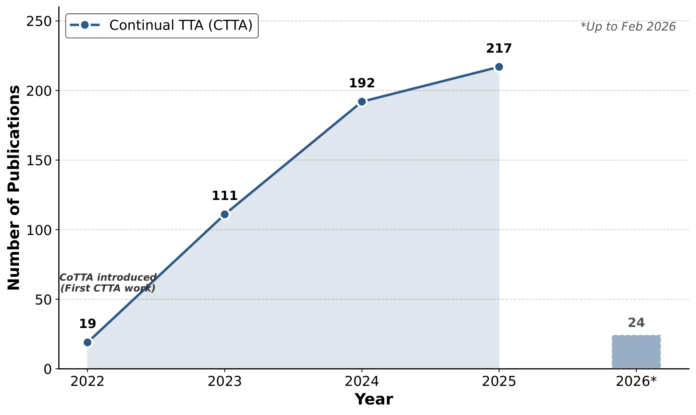

# 🌊 Continual Test-Time Adaptation in Computer Vision
### Methods, Benchmarks, and Future Directions

  
  
  
  

*A curated list of papers, resources, and future directions on **Continual Test-Time Adaptation (CTTA) for Computer Vision**.*

## 📚 Table of Contents

<table>
<tr>
<td valign="top" width="33%">

**🎯 Foundations**
- [Problem & Motivation](#-problem-and-motivation)
- [Need for Online Continual Adaptation](#-need-for-online-continual-adaptation)
- [Unified Taxonomy](#-unified-taxonomy)

</td>
<td valign="top" width="33%">

**🧩 Method Families**
- [Optimization-based](#-optimization-based-approaches)
- [Parameter-Efficient](#-parameter-efficient-methods)
- [Architecture-based](#-architecture-based)

</td>
<td valign="top" width="33%">

**🔬 Resources**
- [Shift Patterns](#-continual-domain-shift-patterns)
- [Benchmarks](#-benchmarks)
- [Future Directions](#-emerging-trends-and-future-directions)
- [Contributing](#-contributing)

</td>
</tr>
</table>

 

---

## 🎯 Problem and Motivation

  

Deep neural nets achieve remarkable performance when training and test data share the same distribution, but this assumption frequently breaks in real-world deployment, where data undergoes continual distributional shifts.

> **Continual Test-Time Adaptation (CTTA)** addresses this challenge by adapting pretrained models to non-stationary target distributions *on-the-fly*, without access to source data or labeled targets, while mitigating two critical failure modes:
> - ⚠️ **Catastrophic forgetting** of source knowledge
> - ⚠️ **Error accumulation** from noisy pseudo-labels over extended time horizons

 

---

## ⚙️ Need for Online Continual Adaptation

<table>
<tr>
<td width="50%" valign="top">

#### 🔒 Data Privacy
Test samples should be processed in an online fashion without storage or reuse, especially in privacy-sensitive settings (e.g., medical or personal devices).

#### ⚡ Real-Time Responsiveness
Adaptation must incur minimal latency. In safety-critical applications such as autonomous driving, even small delays can have significant physical consequences.

</td>
<td width="50%" valign="top">

#### 🌪️ Non-Stationary Environments
Data distributions evolve continuously (e.g., lighting, weather, sensor drift). Repeated passes over outdated data may degrade performance.

#### 💾 Resource Constraints
Edge and embedded devices have limited memory and compute budgets. Adaptation strategies should avoid heavy iterative optimization or large memory overhead.

</td>
</tr>
</table>

### ✨ Emerging Directions

| Direction | Description |
|:---|:---|
| 🎯 **On-Demand Adaptation** | Instead of updating the model continuously, adaptation can be triggered only when a significant domain shift is detected — reducing unnecessary computation while preserving robustness. |
| ➡️ **Forward-only Adaptation** | Removing backpropagation entirely enables lightweight adaptation suitable for resource-constrained or real-time deployment. **FOA** gives a new direction to the field of CTTA. |
| 🏛️ **Adaptation of Foundation Models** | Extending CTTA principles to large-scale pretrained foundation models. |

 

---

## 🗺️ Unified Taxonomy

The figure below illustrates the growth of CTTA research over the years (until Feb 2026).

  

We organize methods into **three main families**, based on what they adapt and their adaptation strategies:

| 🔧 Optimization-based | 🪶 Parameter-Efficient | 🏗️ Architecture-based |
|:---:|:---:|:---:|
| Updates model weights via gradient-based objectives | Selectively updates a small subset of parameters | Modifies or augments model structure |

*We mention the representative papers for each category below.*

 

---

## 🔧 Optimization-based Approaches

We list papers that discuss key paradigms: **(1)** entropy minimization, which encourages confident predictions, **(2)** pseudo-labeling, **(3)** parameter restoration, which helps mitigate forgetting by recovering source knowledge, and **(4)** preservation of class topologies.

<b>📉 Entropy Minimization</b>

 

1. [Tent: Fully Test-Time Adaptation by Entropy Minimization](https://openreview.net/pdf?id=uXl3bZLkr3c) — *ICLR 2021*
2. [Efficient Test-Time Model Adaptation without Forgetting](https://proceedings.mlr.press/v162/niu22a.html) — *ICML 2022*
3. [Towards Stable Test-Time Adaptation in Dynamic Wild World](https://openreview.net/pdf?id=g2YraF75Tj) — *ICLR 2023*
4. [Robust Mean Teacher for Continual and Gradual Test-Time Adaptation](https://openaccess.thecvf.com/content/CVPR2023/papers/Dobler_Robust_Mean_Teacher_for_Continual_and_Gradual_Test-Time_Adaptation_CVPR_2023_paper.pdf) — *CVPR 2023*
5. [SANTA: Source Anchoring Network and Target Alignment for Continual Test Time Adaptation](https://openreview.net/pdf?id=V7guVYzvE4) — *TMLR 2023*
6. [SoTTA: Robust Test-Time Adaptation on Noisy Data Streams](https://arxiv.org/abs/2310.10074) — *NeurIPS 2023*
7. [Entropy is not Enough for Test-Time Adaptation: From the Perspective of Disentangled Factors](https://arxiv.org/abs/2403.07366) — *ICLR 2024*
8. [TEA: Test-time Energy Adaptation](https://arxiv.org/abs/2311.14402) — *CVPR 2024*
9. [Ranked Entropy Minimization for Continual Test-Time Adaptation](https://arxiv.org/abs/2505.16441) — *ICML 2025*
10. [Lifelong Test-Time Adaptation via Online Learning in Tracked Low-Dimensional Subspace](https://openreview.net/pdf?id=NFvAa2hNzH) — *NeurIPS 2025*
11. [Blocking the Leakage: Manifold-Aware Gradient Projection for Long-Horizon Test-Time Adaptation](https://openreview.net/pdf?id=tXG1MOcigF) - *CVPR 2026*

<b>🏷️ Pseudo-Labeling</b>

 

1. [If Your Data Distribution Shifts, Use Self-Learning](https://arxiv.org/abs/2104.12928) — *arXiv 2021*
2. [Continual Test-time Domain Adaptation via Dynamic Sample Selection](https://arxiv.org/abs/2310.03335) — *CVPR 2024*
3. [Contrastive Test-Time Adaptation](https://arxiv.org/abs/2204.10377) — *CVPR 2022*
4. [Less is More: Pseudo-Label Filtering for Continual Test-Time Adaptation](https://arxiv.org/abs/2406.02609) — *arXiv 2024*

<b>♻️ Parameter Restoration</b>

 

1. [Continual Test-Time Domain Adaptation](https://arxiv.org/abs/2203.13591) — *CVPR 2022*
2. [A Probabilistic Framework for Lifelong Test-Time Adaptation](https://arxiv.org/abs/2212.09713) — *CVPR 2023*
3. [Robust Test-Time Adaptation in Dynamic Scenarios](https://arxiv.org/abs/2303.13899) — *CVPR 2023*

<b>🧬 Topology Consistency</b>

 

1. [Maintaining Consistent Inter-Class Topology in Continual Test-Time Adaptation](https://openaccess.thecvf.com/content/CVPR2025/papers/Ni_Maintaining_Consistent_Inter-Class_Topology_in_Continual_Test-Time_Adaptation_CVPR_2025_paper.pdf) — *CVPR 2025*

 

---

## 🪶 Parameter-Efficient Methods

Here, we list works that focus on estimating normalization layer statistics and adaptively selecting parameters to update.

<b>📊 Normalization Layer Statistics</b>

 

1. [Improving Robustness Against Common Corruptions by Covariate Shift Adaptation](https://arxiv.org/abs/2006.16971) — *NeurIPS 2020*
2. [MixNorm: Test-Time Adaptation Through Online Normalization Estimation](https://arxiv.org/abs/2110.11478) — *arXiv 2021*
3. [NOTE: Robust Continual Test-time Adaptation Against Temporal Correlation](https://arxiv.org/abs/2208.05117) — *NeurIPS 2022*
4. [MECTA: Memory-Economic Continual Test-time Adaptation](https://openreview.net/forum?id=N92hjSf5NNh) — *ICLR 2023*
5. [TTN: A Domain-Shift Aware Batch Normalization in Test-Time Adaptation](https://arxiv.org/abs/2302.05155) — *ICCV 2023*

<b>🎛️ Adaptive Updates</b>

 

1. [Layer-wise Auto-Weighting for Non-Stationary Test-Time Adaptation](https://arxiv.org/abs/2311.05858) — *WACV 2024*
2. [PALM: Pushing Adaptive Learning Rate Mechanisms for Continual Test-Time Adaptation](https://arxiv.org/abs/2403.10650) — *AAAI 2025*
3. [Parameter-Selective Continual Test-Time Adaptation](https://openaccess.thecvf.com/content/ACCV2024/papers/Tian_Parameter-Selective_Continual_Test-Time_Adaptation_ACCV_2024_paper.pdf) — *ACCV 2024*
4. [Test-Time Model Adaptation with Only Forward Passes](https://arxiv.org/pdf/2404.01650) — *ICML 2024*

 

---

## 🏗️ Architecture-based

We include papers that modify the model architecture. This includes teacher-student frameworks, adapters, visual prompting, and masked modeling.

<b>👨‍🏫 Teacher-Student Frameworks</b>

 

1. [Continual Test-Time Domain Adaptation](https://arxiv.org/abs/2203.13591) — *CVPR 2022*
2. [Robust Mean Teacher for Continual and Gradual Test-Time Adaptation](https://openaccess.thecvf.com/content/CVPR2023/papers/Dobler_Robust_Mean_Teacher_for_Continual_and_Gradual_Test-Time_Adaptation_CVPR_2023_paper.pdf) — *CVPR 2023*
3. [Parameter-selective continual test-time adaptation](https://openaccess.thecvf.com/content/ACCV2024/html/Tian_Parameter-Selective_Continual_Test-Time_Adaptation_ACCV_2024_paper.html) - *ACCV 2024*
4. [C-CoTTA: Controllable Continual Test-Time Adaptation](https://arxiv.org/abs/2405.14602) — *ICME 2025*
5. [Test-time distillation for continual model adaptation](https://openaccess.thecvf.com/content/CVPR2026F/html/Chen_Test-Time_Distillation_for_Continual_Model_Adaptation_CVPRF_2026_paper.html) - *CVPR 2026*

<b>🔌 Adapters</b>

 

1. [EcoTTA: Memory-Efficient Continual Test-time Adaptation via Self-distilled Regularization](https://arxiv.org/abs/2303.01904) — *CVPR 2023*
2. [ViDA: Homeostatic Visual Domain Adapter for Continual Test Time Adaptation](https://arxiv.org/abs/2306.04344) — *ICLR 2024*
3. [Efficient Test-Time Adaptation of Vision-Language Models](https://arxiv.org/abs/2403.18293) — *CVPR 2024*
4. [Buffer Layers for Test-Time Adaptation](https://openreview.net/pdf?id=sSZ9OM08KT) — *NeurIPS 2025*
5. [The golden subspace: Where efficiency meets generalization in continual test-time adaptation](https://openaccess.thecvf.com/content/CVPR2026/html/Lai_The_Golden_Subspace_Where_Efficiency_Meets_Generalization_in_Continual_Test-Time_CVPR_2026_paper.html) - *CVPR 2026*

<b>💬 Visual Prompting</b>

 

1. [Visual Domain Prompt for Continual Test Time Adaptation](https://arxiv.org/abs/2212.04145) — *AAAI 2023*
2. [OT-VP: Optimal Transport-guided Visual Prompting for Test-Time Adaptation](https://arxiv.org/abs/2407.09498) — *WACV 2024*
3. [DPCore: Dynamic Prompt Coreset for Continual Test-Time Adaptation](https://arxiv.org/abs/2406.10737) — *ICML 2025*
4. [Class-aware Domain Knowledge Fusion and Fission for Continual Test-Time Adaptation](https://openreview.net/pdf?id=F74FXkicGK) — *NeurIPS 2025*

<b>🎭 Masked Modeling</b>

 

1. [Continual-MAE: Adaptive Distribution Masked Autoencoders for Continual Test-Time Adaptation](https://arxiv.org/abs/2312.12480) — *CVPR 2024*
2. [Family Matters: A Systematic Study of Spatial vs. Frequency Masking for Continual Test-Time Adaptation](https://openreview.net/forum?id=pBI64qNXHp) - *TMLR 2026*

 

---

## 🔄 Continual Domain Shift Patterns

| # | Pattern | Description |
|:---:|:---|:---|
| 1️⃣ | **Continual Structured Change** | Target domains arrive in a fixed sequential order |
| 2️⃣ | **Gradual Domain Transitions** | Relax the assumption of abrupt, instantaneous boundaries between consecutive domains *(as in RDumb, BECoTTA)* |
| 3️⃣ | **Sample-Level Shifts** | Mixed shifts, small batch sizes, and online imbalanced label distribution shift *(as in SAR)* |
| 4️⃣ | **Continually Changing Domains** | Temporally correlated sampling *(as in RoTTA)* |
| 5️⃣ | **Continual Dynamic Changes** | Abrupt changes in domains with recurrence *(as in DPCore)* |
| 6️⃣ | **Long-Term Non-Stationary Shifts** | *(as in ReservoirTTA)* |

 

---

## 📊 Benchmarks

### 🖼️ Image Classification

| Dataset | Source Domains | Target Domains | Shift Types |
|:---|:---:|:---:|:---|
| [**CIFAR-10C**](https://zenodo.org/record/2535967#.ZBiI7NDMKUk) | CIFAR-10 | CIFAR-10C | 15 visual corruptions |
| [**CIFAR-100C**](https://zenodo.org/record/3555552#.ZBiJA9DMKUk) | CIFAR-100 | CIFAR-100C | 15 visual corruptions |
| [**ImageNet-C**](https://zenodo.org/record/2235448#.Yj2RO_co_mFg) | ImageNet | ImageNet-C | 15 visual corruptions |
| [**ImageNet-A**](https://github.com/hendrycks/natural-adv-examples) | ImageNet | ImageNet-A | Natural adversarial examples |
| [**ImageNet-R**](https://github.com/hendrycks/imagenet-r) | ImageNet | ImageNet-R | Art, cartoon, graffiti, etc. |

> 💡 **Other datasets:** ImageNet-D, DomainNet, VisDA-C, etc.

### 🧩 Semantic Segmentation

- 🌆 **Cityscapes → ACDC**
- 🚦 **SHIFT Dataset**

 

---

## 🚀 Emerging Trends and Future Directions

| | Direction |
|:---:|:---|
| 🌐 | **Multi-Modal and Cross-Domain CTTA** |
| 🤖 | **Continual Adaptation for LLMs and Multimodal LLMs** |
| 📦 | **Black-Box Adaptation in the Real-World** |
| 🏛️ | **Adaptation for Foundation Models** |
| 🛡️ | **Robustness Under Adversarial and Pathological Shifts** |
| 📐 | **Standardized Benchmarks for Realistic Evaluation** |
| 📖 | **Theoretical Understanding of CTTA** |

 

---

## 🤝 Contributing

We welcome new papers, implementations, and corrections!

**[📋 See our Contributing Guidelines](CONTRIBUTING.md)**

 

*If you find this resource useful, consider giving it a ⭐!*

