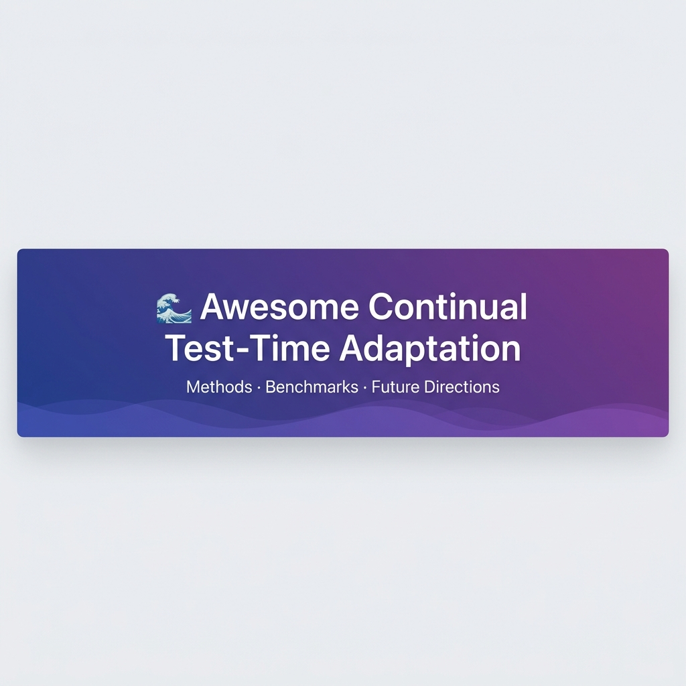

<div align="center">



<br>

<p>
  <a href="https://arxiv.org/abs/2607.08164"></a>
  
</p>
<p>
  <a href="https://github.com/sarthaxxxxx/Awesome-Continual-Test-Time-Adaptation/stargazers"></a>
  <a href="https://github.com/sarthaxxxxx/Awesome-Continual-Test-Time-Adaptation/network/members"></a>
  
  
  <a href="http://makeapullrequest.com"></a>
</p>

<br>

*A comprehensive, curated collection of papers, resources, and future directions on<br>**Continual Test-Time Adaptation (CTTA) for Computer Vision**.*

</div>

<br>


## 📚 Table of Contents

<table>
<tr>
<td valign="top" width="33%">

**🎯 Foundations**
- [Problem & Motivation](#-problem-and-motivation)
- [Need for Online Adaptation](#-need-for-online-continual-adaptation)
- [Unified Taxonomy](#️-unified-taxonomy)

</td>
<td valign="top" width="33%">

**🧩 Method Families**
- [Optimization-based](#-optimization-based-approaches)
- [Parameter-Efficient](#-parameter-efficient-methods)
- [Architecture-based](#️-architecture-based)

</td>
<td valign="top" width="33%">

**🔬 Resources**
- [Shift Patterns](#-continual-domain-shift-patterns)
- [Benchmarks](#-benchmarks)
- [Future Directions](#-emerging-trends-and-future-directions)
- [Citation](#-citation)
- [Contributing](#-contributing)

</td>
</tr>
</table>

<br>


## 🎯 Problem and Motivation

<p align="center">
  
</p>

Deep neural nets achieve remarkable performance when training and test data share the same distribution, but this assumption frequently breaks in real-world deployment, where data undergoes **continual distributional shifts**.

> [!IMPORTANT]
> **Continual Test-Time Adaptation (CTTA)** adapts pretrained models to non-stationary target distributions *on-the-fly* — **without** access to source data or labeled targets — while mitigating two critical failure modes:
>
> | | Failure Mode | Impact |
> |:---:|:---|:---|
> | ⚠️ | **Catastrophic forgetting** | Loss of source knowledge as the model adapts |
> | ⚠️ | **Error accumulation** | Noisy pseudo-labels compound over time |

<br>


## ⚙️ Need for Online Continual Adaptation

<table>
<tr>
<td width="50%" valign="top">

#### 🔒 Data Privacy
Test samples should be processed in an online fashion without storage or reuse, especially in privacy-sensitive settings *(e.g., medical or personal devices)*.

#### ⚡ Real-Time Responsiveness
Adaptation must incur minimal latency. In safety-critical applications such as autonomous driving, even small delays can have significant consequences.

</td>
<td width="50%" valign="top">

#### 🌪️ Non-Stationary Environments
Data distributions evolve continuously *(e.g., lighting, weather, sensor drift)*. Repeated passes over outdated data may degrade performance.

#### 💾 Resource Constraints
Edge and embedded devices have limited memory and compute budgets. Adaptation strategies should avoid heavy iterative optimization or large memory overhead.

</td>
</tr>
</table>

<br>

<div align="center">

### ✨ Emerging Paradigms

</div>

| | Direction | Description |
|:---:|:---|:---|
| 🎯 | **On-Demand Adaptation** | Trigger adaptation only when a significant domain shift is detected — reducing unnecessary computation while preserving robustness. |
| ➡️ | **Forward-Only Adaptation** | Remove backpropagation entirely for lightweight adaptation suitable for resource-constrained or real-time deployment. |
| 🏛️ | **Foundation Model Adaptation** | Extend CTTA principles to large-scale pretrained foundation models. |

<br>


## 🗺️ Unified Taxonomy

<div align="center">

The figure below illustrates the growth of CTTA research over the years (until Feb 2026).

</div>

<p align="center">
  
</p>

We organize methods into **three main families**, based on *what* they adapt and *how* they adapt:

<div align="center">

<table>
<tr>
<td align="center" width="33%">

**🔧 Optimization-based**
<br><sub>Updates model weights via<br>gradient-based objectives</sub>

</td>
<td align="center" width="33%">

**🪶 Parameter-Efficient**
<br><sub>Selectively updates a small<br>subset of parameters</sub>

</td>
<td align="center" width="33%">

**🏗️ Architecture-based**
<br><sub>Modifies or augments<br>model structure</sub>

</td>
</tr>
</table>

</div>

> [!TIP]
> Representative papers for each category are listed below, organized by sub-paradigm.

<br>


## 🔧 Optimization-based Approaches

Key paradigms include **(1)** entropy minimization for confident predictions, **(2)** pseudo-labeling, **(3)** parameter restoration to recover source knowledge, and **(4)** preservation of class topologies.

<details open>
<summary><b>📉 Entropy Minimization</b></summary>
<br>

| # | Paper | Venue |
|:---:|:---|:---:|
| 1 | [Tent: Fully Test-Time Adaptation by Entropy Minimization](https://openreview.net/pdf?id=uXl3bZLkr3c) | `ICLR 2021` |
| 2 | [Efficient Test-Time Model Adaptation without Forgetting](https://proceedings.mlr.press/v162/niu22a.html) | `ICML 2022` |
| 3 | [Towards Stable Test-Time Adaptation in Dynamic Wild World](https://openreview.net/pdf?id=g2YraF75Tj) | `ICLR 2023` |
| 4 | [Robust Mean Teacher for Continual and Gradual Test-Time Adaptation](https://openaccess.thecvf.com/content/CVPR2023/papers/Dobler_Robust_Mean_Teacher_for_Continual_and_Gradual_Test-Time_Adaptation_CVPR_2023_paper.pdf) | `CVPR 2023` |
| 5 | [SANTA: Source Anchoring Network and Target Alignment for Continual Test Time Adaptation](https://openreview.net/pdf?id=V7guVYzvE4) | `TMLR 2023` |
| 6 | [SoTTA: Robust Test-Time Adaptation on Noisy Data Streams](https://arxiv.org/abs/2310.10074) | `NeurIPS 2023` |
| 7 | [Entropy is not Enough for Test-Time Adaptation: From the Perspective of Disentangled Factors](https://arxiv.org/abs/2403.07366) | `ICLR 2024` |
| 8 | [TEA: Test-time Energy Adaptation](https://arxiv.org/abs/2311.14402) | `CVPR 2024` |
| 9 | [Ranked Entropy Minimization for Continual Test-Time Adaptation](https://arxiv.org/abs/2505.16441) | `ICML 2025` |
| 10 | [Lifelong Test-Time Adaptation via Online Learning in Tracked Low-Dimensional Subspace](https://openreview.net/pdf?id=NFvAa2hNzH) | `NeurIPS 2025` |
| 11 | [Blocking the Leakage: Manifold-Aware Gradient Projection for Long-Horizon Test-Time Adaptation](https://openreview.net/pdf?id=tXG1MOcigF) | `CVPR 2026` |

</details>

<details open>
<summary><b>🏷️ Pseudo-Labeling</b></summary>
<br>

| # | Paper | Venue |
|:---:|:---|:---:|
| 1 | [If Your Data Distribution Shifts, Use Self-Learning](https://arxiv.org/abs/2104.12928) | `arXiv 2021` |
| 2 | [Contrastive Test-Time Adaptation](https://arxiv.org/abs/2204.10377) | `CVPR 2022` |
| 3 | [Continual Test-time Domain Adaptation via Dynamic Sample Selection](https://arxiv.org/abs/2310.03335) | `CVPR 2024` |
| 4 | [Less is More: Pseudo-Label Filtering for Continual Test-Time Adaptation](https://arxiv.org/abs/2406.02609) | `arXiv 2024` |

</details>

<details open>
<summary><b>♻️ Parameter Restoration</b></summary>
<br>

| # | Paper | Venue |
|:---:|:---|:---:|
| 1 | [Continual Test-Time Domain Adaptation](https://arxiv.org/abs/2203.13591) | `CVPR 2022` |
| 2 | [A Probabilistic Framework for Lifelong Test-Time Adaptation](https://arxiv.org/abs/2212.09713) | `CVPR 2023` |
| 3 | [Robust Test-Time Adaptation in Dynamic Scenarios](https://arxiv.org/abs/2303.13899) | `CVPR 2023` |

</details>

<details open>
<summary><b>🧬 Topology Consistency</b></summary>
<br>

| # | Paper | Venue |
|:---:|:---|:---:|
| 1 | [Maintaining Consistent Inter-Class Topology in Continual Test-Time Adaptation](https://openaccess.thecvf.com/content/CVPR2025/papers/Ni_Maintaining_Consistent_Inter-Class_Topology_in_Continual_Test-Time_Adaptation_CVPR_2025_paper.pdf) | `CVPR 2025` |

</details>

<br>


## 🪶 Parameter-Efficient Methods

Works focusing on estimating normalization layer statistics and adaptively selecting parameters to update.

<details open>
<summary><b>📊 Normalization Layer Statistics</b></summary>
<br>

| # | Paper | Venue |
|:---:|:---|:---:|
| 1 | [Improving Robustness Against Common Corruptions by Covariate Shift Adaptation](https://arxiv.org/abs/2006.16971) | `NeurIPS 2020` |
| 2 | [MixNorm: Test-Time Adaptation Through Online Normalization Estimation](https://arxiv.org/abs/2110.11478) | `arXiv 2021` |
| 3 | [NOTE: Robust Continual Test-time Adaptation Against Temporal Correlation](https://arxiv.org/abs/2208.05117) | `NeurIPS 2022` |
| 4 | [MECTA: Memory-Economic Continual Test-time Adaptation](https://openreview.net/forum?id=N92hjSf5NNh) | `ICLR 2023` |
| 5 | [TTN: A Domain-Shift Aware Batch Normalization in Test-Time Adaptation](https://arxiv.org/abs/2302.05155) | `ICCV 2023` |

</details>

<details open>
<summary><b>🎛️ Adaptive Updates</b></summary>
<br>

| # | Paper | Venue |
|:---:|:---|:---:|
| 1 | [Layer-wise Auto-Weighting for Non-Stationary Test-Time Adaptation](https://arxiv.org/abs/2311.05858) | `WACV 2024` |
| 2 | [Parameter-Selective Continual Test-Time Adaptation](https://openaccess.thecvf.com/content/ACCV2024/papers/Tian_Parameter-Selective_Continual_Test-Time_Adaptation_ACCV_2024_paper.pdf) | `ACCV 2024` |
| 3 | [Test-Time Model Adaptation with Only Forward Passes](https://arxiv.org/pdf/2404.01650) | `ICML 2024` |
| 4 | [PALM: Pushing Adaptive Learning Rate Mechanisms for Continual Test-Time Adaptation](https://arxiv.org/abs/2403.10650) | `AAAI 2025` |

</details>

<br>


## 🏗️ Architecture-based

Methods that modify the model architecture — including teacher-student frameworks, adapters, visual prompting, and masked modeling.

<details open>
<summary><b>👨‍🏫 Teacher-Student Frameworks</b></summary>
<br>

| # | Paper | Venue |
|:---:|:---|:---:|
| 1 | [Continual Test-Time Domain Adaptation](https://arxiv.org/abs/2203.13591) | `CVPR 2022` |
| 2 | [Robust Mean Teacher for Continual and Gradual Test-Time Adaptation](https://openaccess.thecvf.com/content/CVPR2023/papers/Dobler_Robust_Mean_Teacher_for_Continual_and_Gradual_Test-Time_Adaptation_CVPR_2023_paper.pdf) | `CVPR 2023` |
| 3 | [Parameter-selective continual test-time adaptation](https://openaccess.thecvf.com/content/ACCV2024/html/Tian_Parameter-Selective_Continual_Test-Time_Adaptation_ACCV_2024_paper.html) | `ACCV 2024` |
| 4 | [C-CoTTA: Controllable Continual Test-Time Adaptation](https://arxiv.org/abs/2405.14602) | `ICME 2025` |
| 5 | [Test-time distillation for continual model adaptation](https://openaccess.thecvf.com/content/CVPR2026F/html/Chen_Test-Time_Distillation_for_Continual_Model_Adaptation_CVPRF_2026_paper.html) | `CVPR 2026` |

</details>

<details open>
<summary><b>🔌 Adapters</b></summary>
<br>

| # | Paper | Venue |
|:---:|:---|:---:|
| 1 | [EcoTTA: Memory-Efficient Continual Test-time Adaptation via Self-distilled Regularization](https://arxiv.org/abs/2303.01904) | `CVPR 2023` |
| 2 | [ViDA: Homeostatic Visual Domain Adapter for Continual Test Time Adaptation](https://arxiv.org/abs/2306.04344) | `ICLR 2024` |
| 3 | [Efficient Test-Time Adaptation of Vision-Language Models](https://arxiv.org/abs/2403.18293) | `CVPR 2024` |
| 4 | [Buffer Layers for Test-Time Adaptation](https://openreview.net/pdf?id=sSZ9OM08KT) | `NeurIPS 2025` |
| 5 | [The golden subspace: Where efficiency meets generalization in continual test-time adaptation](https://openaccess.thecvf.com/content/CVPR2026/html/Lai_The_Golden_Subspace_Where_Efficiency_Meets_Generalization_in_Continual_Test-Time_CVPR_2026_paper.html) | `CVPR 2026` |

</details>

<details open>
<summary><b>💬 Visual Prompting</b></summary>
<br>

| # | Paper | Venue |
|:---:|:---|:---:|
| 1 | [Visual Domain Prompt for Continual Test Time Adaptation](https://arxiv.org/abs/2212.04145) | `AAAI 2023` |
| 2 | [OT-VP: Optimal Transport-guided Visual Prompting for Test-Time Adaptation](https://arxiv.org/abs/2407.09498) | `WACV 2024` |
| 3 | [DPCore: Dynamic Prompt Coreset for Continual Test-Time Adaptation](https://arxiv.org/abs/2406.10737) | `ICML 2025` |
| 4 | [Class-aware Domain Knowledge Fusion and Fission for Continual Test-Time Adaptation](https://openreview.net/pdf?id=F74FXkicGK) | `NeurIPS 2025` |

</details>

<details open>
<summary><b>🎭 Masked Modeling</b></summary>
<br>

| # | Paper | Venue |
|:---:|:---|:---:|
| 1 | [Continual-MAE: Adaptive Distribution Masked Autoencoders for Continual Test-Time Adaptation](https://arxiv.org/abs/2312.12480) | `CVPR 2024` |
| 2 | [Family Matters: A Systematic Study of Spatial vs. Frequency Masking for Continual Test-Time Adaptation](https://openreview.net/forum?id=pBI64qNXHp) | `TMLR 2026` |

</details>

<br>


## 🔄 Continual Domain Shift Patterns

<div align="center">

| # | Pattern | Description |
|:---:|:---|:---|
| 1️⃣ | **Continual Structured Change** | Target domains arrive in a fixed sequential order |
| 2️⃣ | **Gradual Domain Transitions** | Relaxes the assumption of abrupt boundaries between domains *(RDumb, BECoTTA)* |
| 3️⃣ | **Sample-Level Shifts** | Mixed shifts, small batch sizes, and online imbalanced label distribution shift *(SAR)* |
| 4️⃣ | **Continually Changing Domains** | Temporally correlated sampling *(RoTTA)* |
| 5️⃣ | **Continual Dynamic Changes** | Abrupt changes in domains with recurrence *(DPCore)* |
| 6️⃣ | **Long-Term Non-Stationary Shifts** | Extended temporal non-stationarity *(ReservoirTTA)* |

</div>

<br>


## 📊 Benchmarks

### 🖼️ Image Classification

<div align="center">

| Dataset | Source | Target | Shift Types |
|:---|:---:|:---:|:---|
| [**CIFAR-10C**](https://zenodo.org/record/2535967#.ZBiI7NDMKUk) | CIFAR-10 | CIFAR-10C | 15 visual corruptions |
| [**CIFAR-100C**](https://zenodo.org/record/3555552#.ZBiJA9DMKUk) | CIFAR-100 | CIFAR-100C | 15 visual corruptions |
| [**ImageNet-C**](https://zenodo.org/record/2235448#.Yj2RO_co_mFg) | ImageNet | ImageNet-C | 15 visual corruptions |
| [**ImageNet-A**](https://github.com/hendrycks/natural-adv-examples) | ImageNet | ImageNet-A | Natural adversarial examples |
| [**ImageNet-R**](https://github.com/hendrycks/imagenet-r) | ImageNet | ImageNet-R | Art, cartoon, graffiti, etc. |

</div>

> [!NOTE]
> **Other popular datasets:** ImageNet-D, DomainNet, VisDA-C, and more.

### 🧩 Semantic Segmentation

<div align="center">

| Dataset | Description |
|:---|:---|
| 🌆 **Cityscapes → ACDC** | Urban driving under adverse conditions |
| 🚦 **SHIFT Dataset** | Synthetic multi-domain driving scenarios |

</div>

<br>


## 🚀 Emerging Trends and Future Directions

<div align="center">

| | Direction | Key Challenges |
|:---:|:---|:---|
| 🌐 | **Multi-Modal & Cross-Domain CTTA** | Bridging modality gaps under shift |
| 🤖 | **Continual Adaptation for LLMs & Multimodal LLMs** | Scale, cost, and catastrophic forgetting |
| 📦 | **Black-Box Adaptation** | No access to model internals |
| 🏛️ | **Foundation Model Adaptation** | Efficient adaptation without full fine-tuning |
| 🛡️ | **Robustness Under Adversarial Shifts** | Adversarial and pathological distributions |
| 📐 | **Standardized Benchmarks** | Realistic, reproducible evaluation protocols |
| 📖 | **Theoretical Understanding** | Convergence, generalization bounds for CTTA |

</div>

<br>


## 📖 Citation

If you find this survey useful in your research, please consider citing:

```bibtex
@article{maharana2025ctta_survey,
  title   = {Continual Test-Time Adaptation in Computer Vision: Methods, Benchmarks, and Future Directions},
  author  = {Maharana, Sarthak and others},
  journal = {Transactions on Machine Learning Research (TMLR)},
  year    = {2025},
  url     = {https://arxiv.org/abs/2607.08164}
}
```

<br>


## 🤝 Contributing

<div align="center">

We welcome new papers, implementations, and corrections!

**[📋 See our Contributing Guidelines](CONTRIBUTING.md)**

<br>

*If you find this resource useful, consider giving it a ⭐!*

<br>

<div align="center">

